# POCMAN

## 🔥 初心

**原本刚入行，抱着玩的心态写下了这个工具**

**没想过时间过去这么久，脚本越写越多，就整理成工具了**

**现在也是打算分享出来，工具使用python做了简单的开发，如果需要二次开发也很简单**

## 💻 介绍

**这是一款很适合新手宝宝的工具**

**刚入行时，几个大佬对我说信息收集的重要，于是这个工具着重信息收集方面，侧重于POC收集**

## 👽 使用

**直接运行pocman.py即可使用，没有多余参数要求**

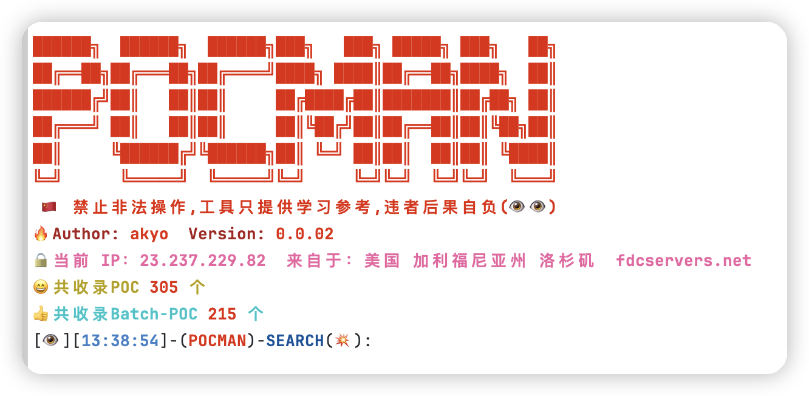

### 📓 **工具主要是三个模块一个Search模块，一个Batch模块**，还有Attack模块

## Search 模块

~~~text
Search 用于对特殊关键字进行搜索，返回相关结果
例如：search web
~~~

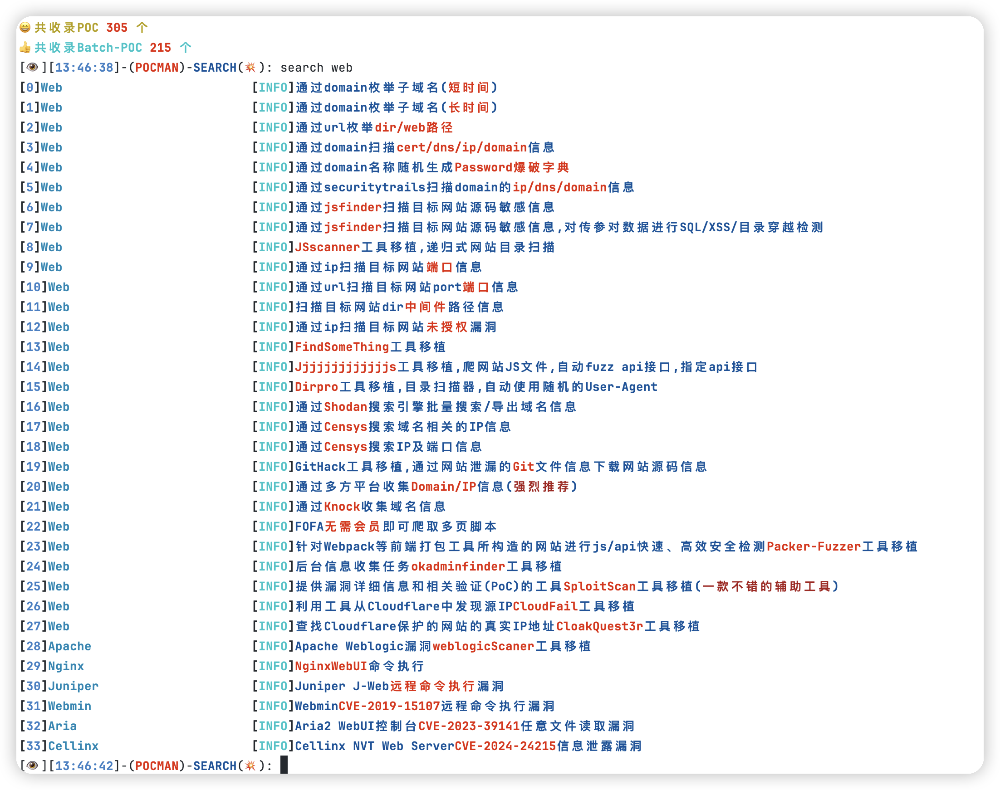

### 输入"use 编号"，可进入poc参数设置

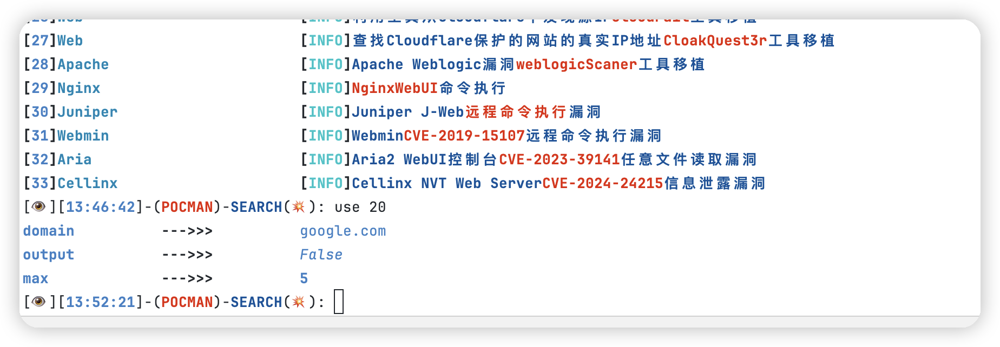

### 直接输入对应序号

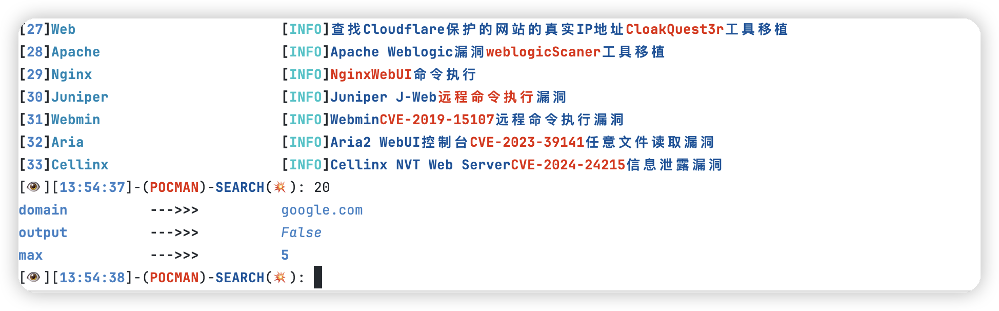

### 输入对应的名称并赋值

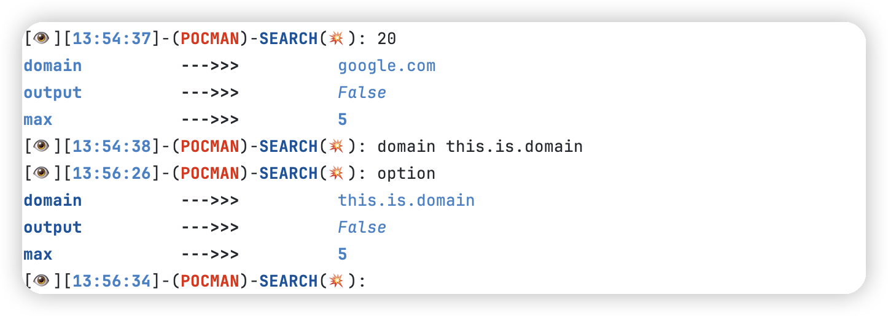

### option/options可查看当前所传递的值，

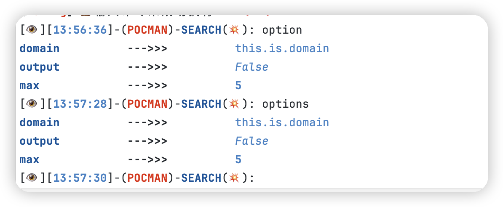

### 当然若是想搜索其他脚本，可继续使用search并利用

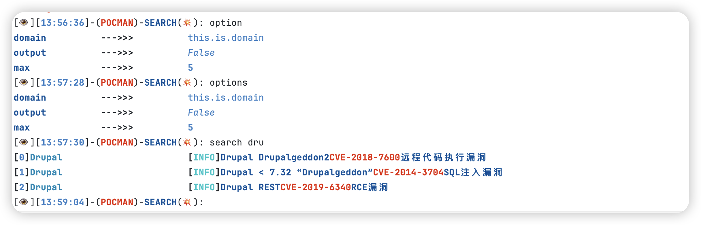

### ⚠️**需要注意的是**

~~~text
proxy 代理 若没有设置代理则为None，如果手动传入 格式："http://120.0.0.1:1082"
值为Ture的对象 可通过赋值True/true 为False/None同理
~~~

### 运行脚本输入run即可运行

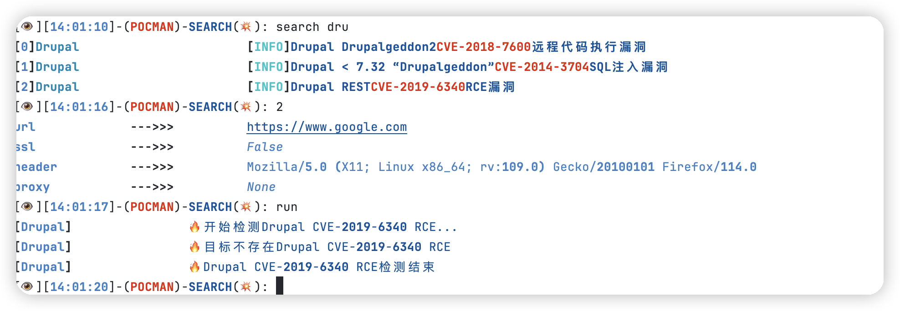

### **配置文件**set/config.py

**脚本内置参数**

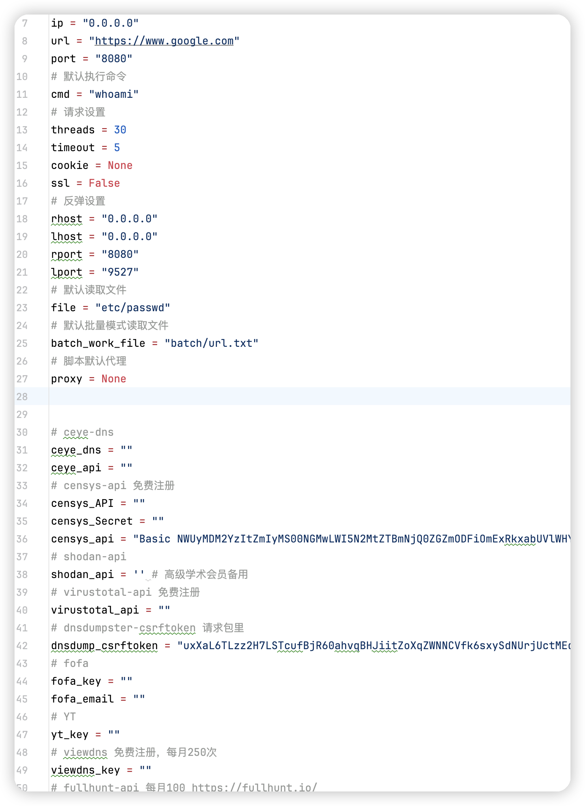

### Batch模式(批量模式)

#### 直接输入batch即可进入批量模式

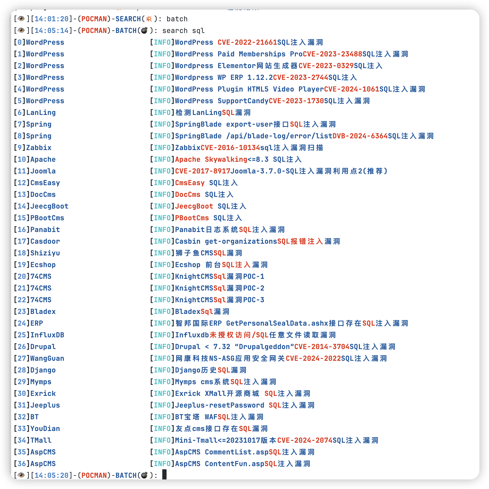

### ATTACK模式

#### 直接输入attack即可进入主动扫描模式

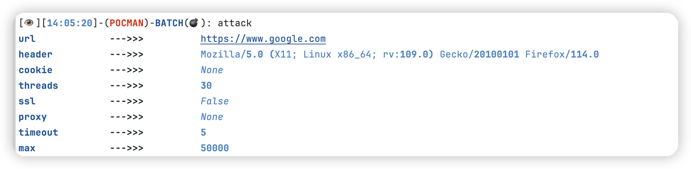**主动攻击模式下脚本会递归式爬取网站能爬取的所有链接，会根据域名防止跳转第三方网站**

**执行过程中会更具前端的信息判断CMS及插件特征信息调用相关POC**

**执行过程如下**

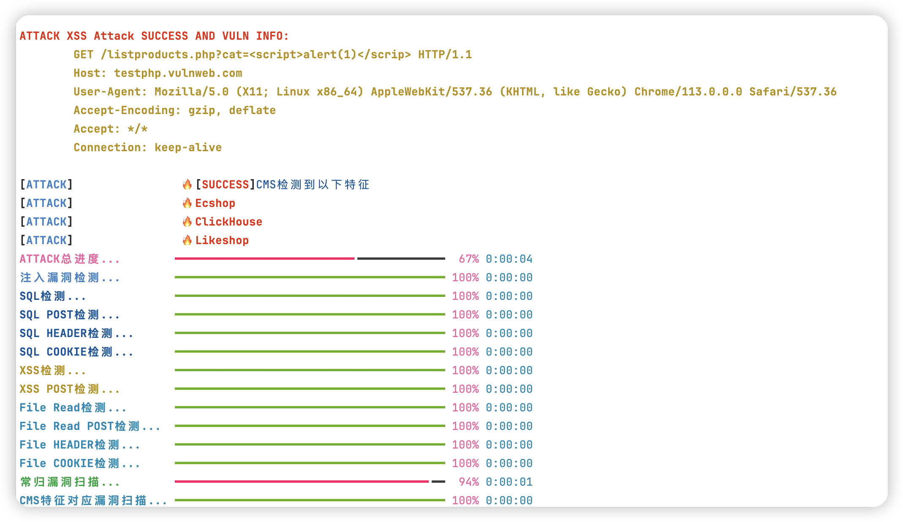

**命中漏洞如下显示**

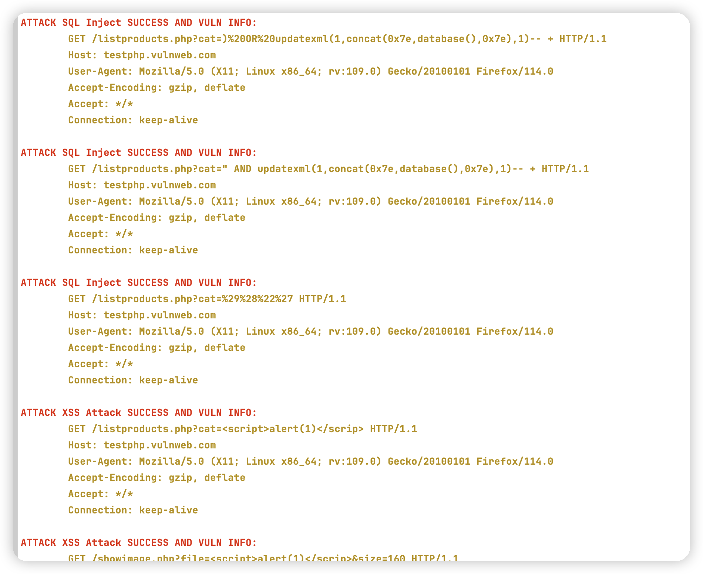

#### Batch/Attack模式操作方式于search一样

#### ⚠️**需要注意的是**

**任何模式下及情况下都可以通过直接输入模块命进入对应模块**

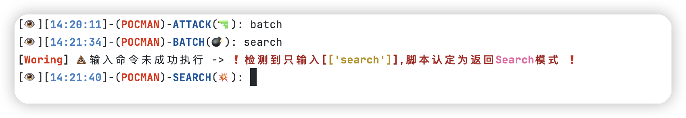

### 作者很懒，就到这吧

