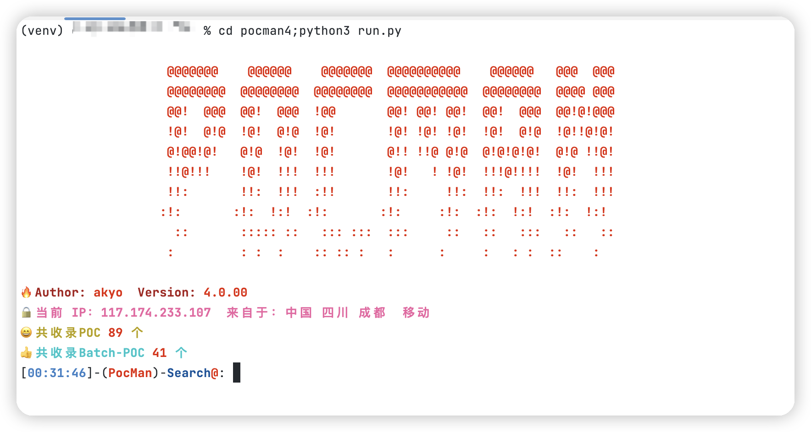
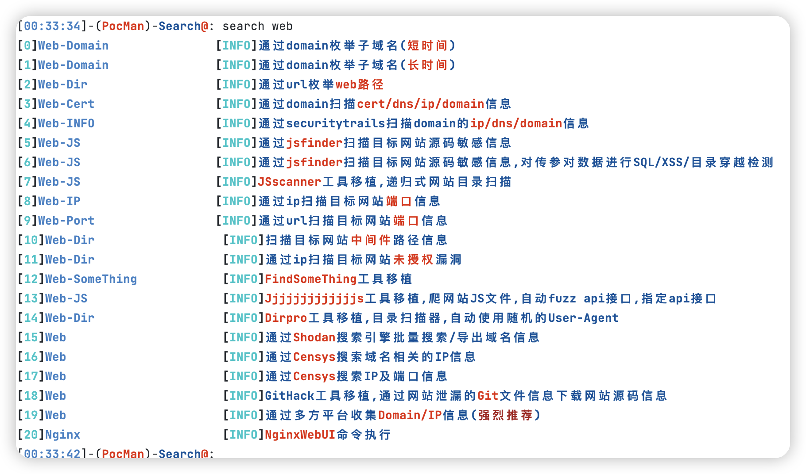
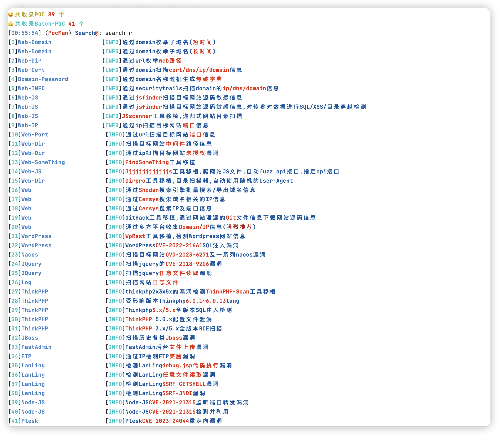
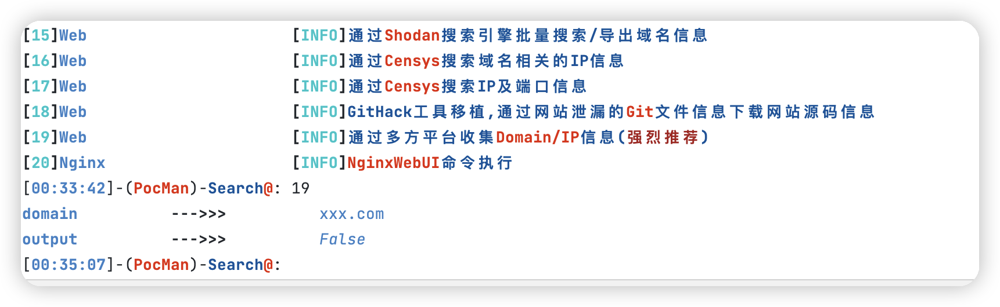
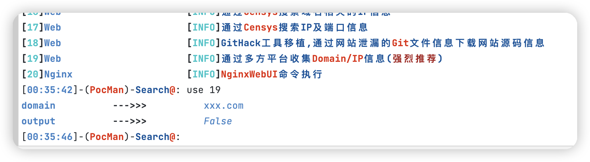
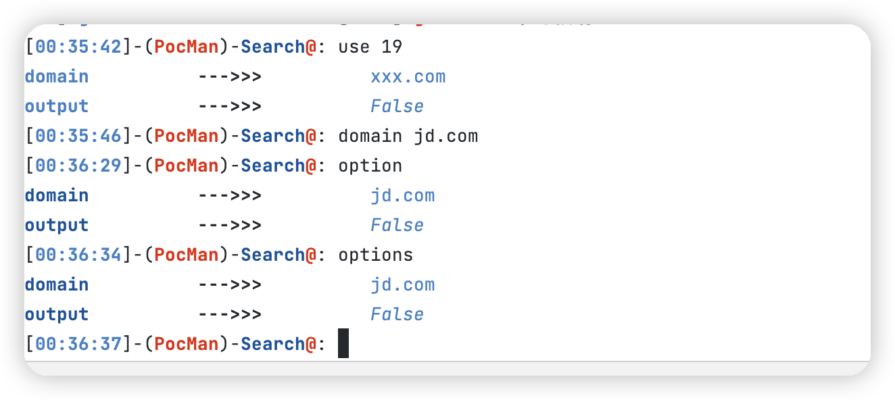
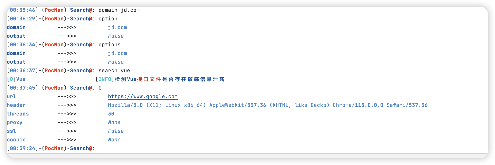
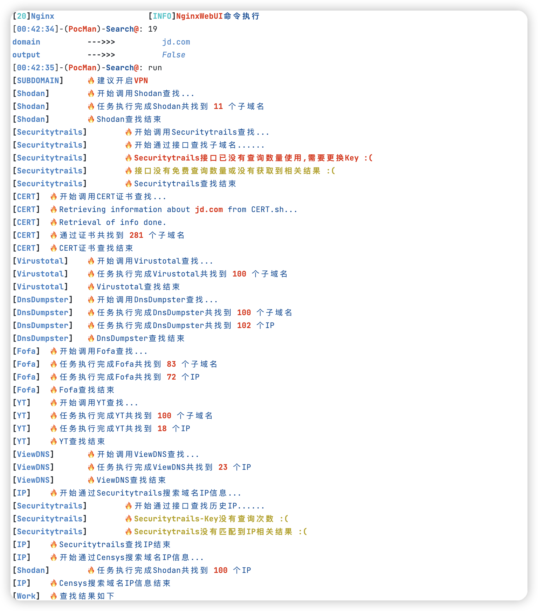
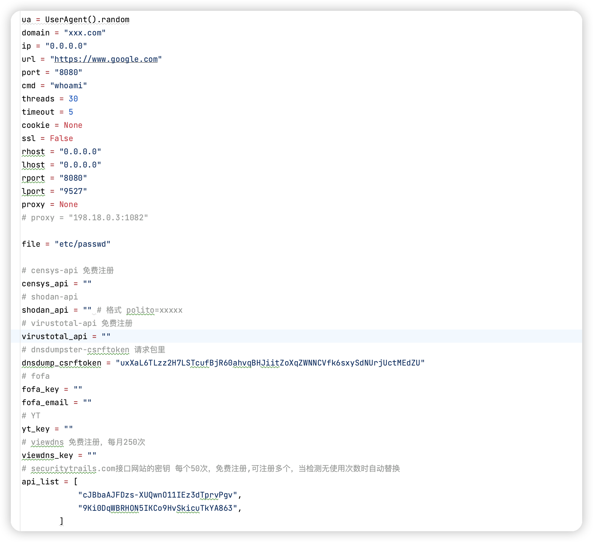
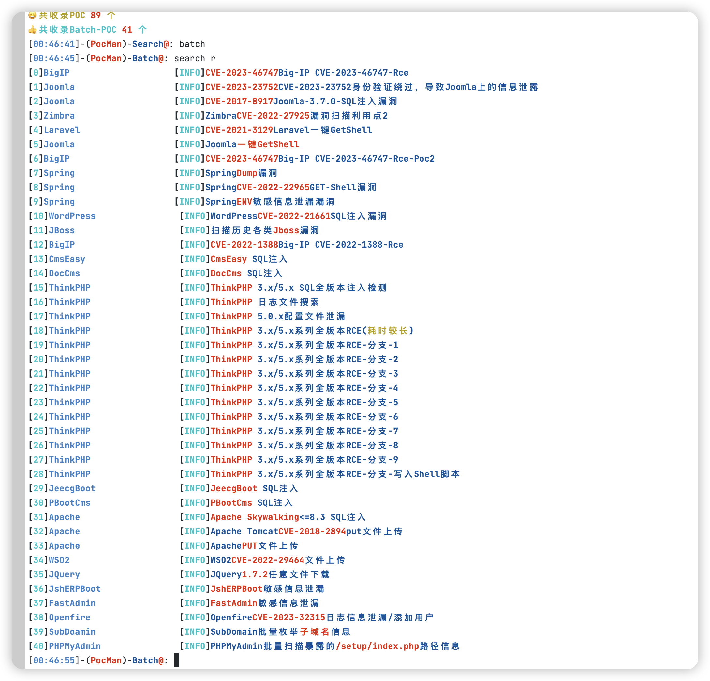

# POCMAN

## 🔥 初心

**本来想着做个脚本小子，抱着玩的心态写下了这个工具**
**没想过现在越写越多，由于个人比较喜欢MSF**
**使用python代码用了一些简单的方式来实现，二次开发利用也会很方便**

## 💻 介绍

**这是一款很适合信息收集与脚本利用的工具**

**工具着重信息收集方面，侧重于POC收集**

## 👽 使用
~~~text
pip3 install -r requirements.txt
python3 run.py
~~~

**直接运行run.py即可使用，没有多余参数要求**

### 📓 **工具主要是两个模块一个Search模块，一个Batch模块**

~~~text
Search 用于对特殊关键字进行搜索，返回相关结果
例如：search web
~~~

### 输入对应编号就可使用，或者使用use + 编号

### use 19

### 输入对应的名称并赋值

### option/options可查看当前所传递的值，

### 当然若是想搜索其他脚本，可继续使用search并利用

### ⚠️**需要注意的是**

~~~text
proxy 代理 若没有设置代理则为None，如果手动传入 格式：127.0.0.1:8080
值为False的对象 可通过赋值True/true 为True同理
~~~

### 运行脚本输入run即可运行

**信息收集设置的最大值为100,想着设置太大费时间**

### **配置文件**set/config.py

**脚本内置参数**

### Batch模式(批量模式)

### 操作方式于search一样

### 作者很懒，就到这吧

