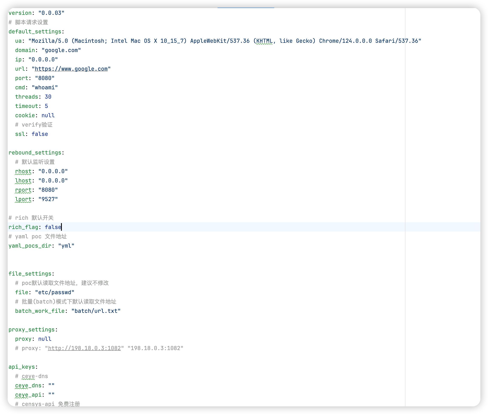

# POCMAN

## 🔥 初心

**原本刚入行，抱着玩的心态写下了这个工具**

**没想过时间过去这么久，脚本越写越多，就整理成工具了**

## 💻 介绍

**由于遇到框架，苦于寻找poc，故该工具便由此而来**

**注：yaml-poc暂时处于开发状态,大部分yaml-poc无法正常执行**

## 📅 2024-08-30
**🤔 新增5-6w指纹库**
~~~
指纹库在验证存活时自动识别,使用方式
search web
use 17

此脚本追加存活验证,Fuzz敏感域名
目前调用第三方有以下平台:
daydaymap
hunter.how
Chaziyu
crt.sh
whoisxmlapi
binaryedge
quake
鹰图
zoomeye
Rapiddns
Sitedossier
jldc.me
google
ViewDNS
C99NL
Alienvault
Dnshistory
Hackertarget
Certspotter
Fullhunt
fofa
dnsdumpster
virustotal
shodan
censys
Netlas
Securitytrails
...
相当于执行脚本传入域名一次性查询上述所有平台
~~~

**🤔 新增部分poc**
~~~
追加几个0day(未公开)
追加几个最近遇到的poc
...
~~~

**🤔 新增辅助脚本**
~~~
rsa加密爆破生成
jwt密钥爆破
...
~~~

**🤔 修改部分代码漏洞及异常处理**
~~~
导入脚本时包名异常处理
脚本其他bug及异常
...
~~~

**🤔 修改rich输出样式**
~~~
后续可能删除rich样式或者统一
~~~
**🤔 新增yaml脚本运行**
~~~
部分yaml脚本可成功运行，后续追加
~~~

## 👽 使用
**拉取工具**

~~~
git clone https://github.com/akyosk/pocman.git
~~~

**安装依赖,绝大多数依赖都为后加载，若不安装依赖启动可能不受影响，但调用poc时会出错**

~~~
cd pocman ; pip install -r requirements.txt
~~~

**直接运行pocman.py即可使用，--rich启用rich模版输出**

~~~
python pocman.py --rich
~~~

~~~
python pocman.py
~~~

### 📓 **工具主要是三个模块一个Search模块，一个Batch模块**，还有Attack模块

## Search 模块

~~~text
Search 用于对特殊关键字进行搜索，返回相关结果
例如：search web
注：通过上下键可调用之前输入
~~~

### 输入"use +编号"，可进入poc参数设置

~~~
同msf可重复使用use获取指定poc
~~~

### 输入对应的名称并赋值

~~~
option/options可查看当前赋值信息
~~~

### ⚠️**需要注意的是**

~~~text
proxy 代理 若没有设置代理则为None，如果手动传入 格式："http://120.0.0.1:1082"
值为Ture的对象 可通过赋值True/true 为False/None同理
~~~

### 运行脚本输入run即可运行

### **配置文件**set/config.yaml

~~~
脚本内置默认参数
~~~

## Batch模式(批量模式)

~~~
直接输入batch即可进入批量模式,同时会变为BATCH字段
~~~

## ATTACK模式

~~~
attack模式目前简单开发，后期会慢慢更进
直接输入attack即可进入主动扫描模式
主动攻击模式下脚本会递归式爬取网站能爬取的所有链接，会根据域名防止跳转第三方网站
执行过程中会根据前端的信息判断CMS及插件特征信息调用相关POC
~~~

~~~
执行过程如下
~~~

~~~
命中漏洞如下显示
~~~

#### Batch/Attack模式操作方式于search一样

#### ⚠️**需要注意的是**

**任何模式下及情况下都可以通过直接输入模块命进入对应模块**

### 作者很懒，就到这吧

